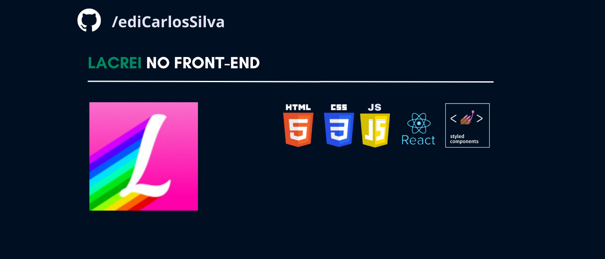

<h1 align="center"> Projeto front-end - Lacrei</h1>

 

## Após download execute o comando abaixo para instalar as dependêncais do projeto:
```
npm install
```

## Para rodar o projeto localmente, execute:
```
npm start
```

### Deploy feito utilizando a platafor vercel [aqui](https://desafio-lacrei-rho.vercel.app/).

